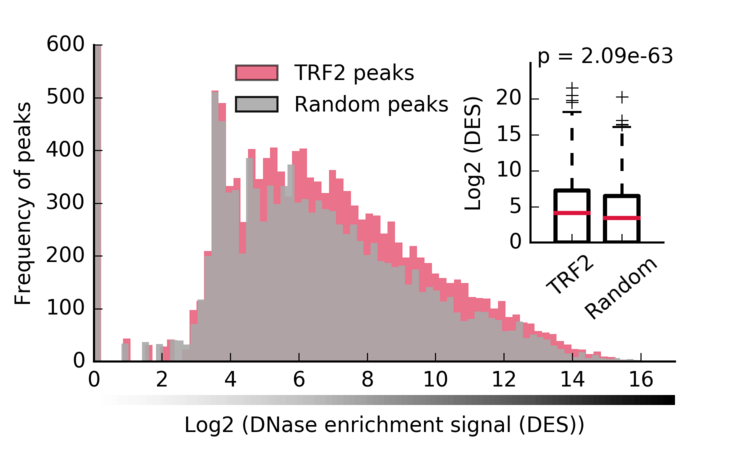

# TRF2-DNase-ChIP
Codes for data processing and figure generation

### R packages
```{}
install.packages(c("progess","plyr","ggplot2"))
```
### python modules used
```{}
import numpy 
import matplotlib
import seaborn
import scipy
import pybedtools
import pysam
import json
import pandas
import re
import collections
import itertools
import tables
```
### Download ENCODE DNase files
- Download and store the DNase file using the meta file information.
```{shell}
Rscript 1-a-download-DNase-ENCODE.R
```
- Rename DNase files
```{shell}
Rscript 1-b-recode-DNase.R
```

- Download hg19 chromosome length file
```{shell}
Rscript 1-c-hg19-information.R
```

### Compute DES per chromosome
- DES in TRF2 vs Random
```{shell}
python 2-b-Figure-2A.py
```
Figure-2A

- DES per chromosome comparison
```{shell}
Rscript 2-c-Suppl-Figure-2.R
```
Supplementary figure-2

- DES differences between TRF2 and Random
```{shell}
python 2-d-Figure-2B-TRF2vsRandom.py
```
Figure-2B

### Histones marks overlap with TRF2
- Download Histone peaks from ENCODE
```{shell}
Rscript 3-a-download-ENCODE-Histone-marks.R
```
- Find closest mark
```{shell}
python 3-b-histones-closest-dist.py
```
- Format histone file names
```{shell}
Rscript 3-c-format-filename-histone-marks.R
```
- Generate Figure 2A-C and supplementary figure 4A-D
```{shell}
python 3-d-generate-Fig-3A-C-and-Suppl-fig-4A-D.py
```
Figure-3A

Figure-3B

Figure-3C


